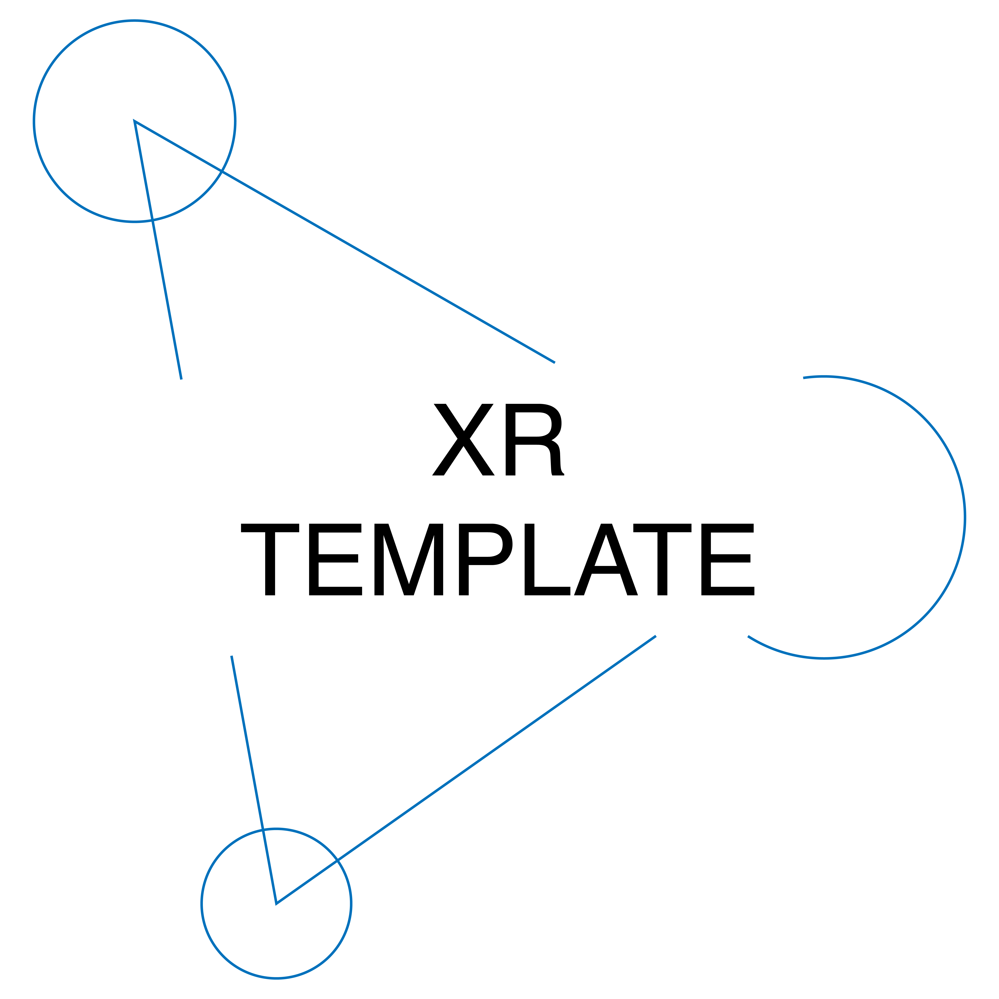

# EXP
Embodied XR Performance Framework is a framework for creating immersive performances, mostly in Unreal Engine.
The framework is currently under heavy development and can be majorly refactored at any time.
If you are bold enough to try it, we recommend Unreal Engine 5.3.

You can check our [WIKI](https://github.com/CREW-Brussels/EXP/wiki) for complete documentation.

It consists of:

## CREW XR Template

A multiplayer project with advanced features for performative LBX.

***

## CHORUS

https://github.com/CREW-Brussels/CHORUS

### CHORUS animation susbsystem
The CHORUS Animation subsystem records animation data into buffers and plays it back in different ways.

### Interactive Performer Tools
Interactive Performance Tools that leverage this system in different ways for the performers.

### CREWAnimationUtilities
CREW AnimationUtilities to solve problems such as drift correction

***

## SPIN (SPatial Interface Network) 

https://github.com/CREW-Brussels/SPIN

SPatial Interface Network is a unity app that runs on an android HMD.
It collects data from sensors such as Vive Ultimate Tracker and sends it over Open Sound Control to other applications.
It can be controlled through a web interface.

***

## CIRCA (Crew InteRaCtive Archive)

https://github.com/CREW-Brussels/CIRCAPlayer

Crew InteRaCtive Archive is a way for recording performances into Unreal, baking them into a standalone application which can be used for playback with or without VR headset.

***

## About
  

>EXP is being developed by [CREW](http://crew.brussels) as part of [EMIL](https://emil-xr.eu/), the European Media and Immersion Lab, an Innovation Action funded by the European Union and co-funded by Innovate UK. 

## Funding

>This project has received funding from the European Union's Horizon Europe Research and Innovation Programme under Grant Agreement No 101070533 EMIL.
