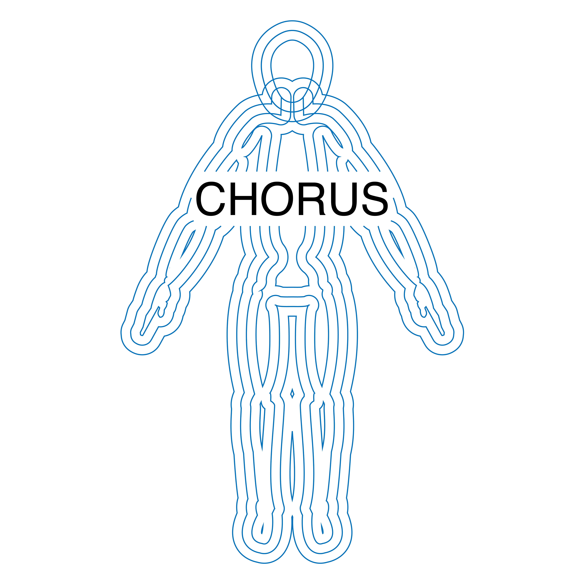

# EXP
Embodied XR Performance Framework is a framework for creating immersive performances, mostly in Unreal Engine.
The documentation is still going under a bit of refinement to be as clear as glass, but all of the submodules created for this project are ready-to-use.
If you are bold enough to try it, we recommend Unreal Engine 5.3.

You can check our [WIKI](https://github.com/CREW-Brussels/EXP/wiki) or the README of each submodule for complete documentation.

It consists of:

## [1. CREW EXP Template](https://github.com/CREW-Brussels/CREWNetworkFramework)

A multiplayer project with advanced features for performative LBX.

***

## [2.1 SPIN (SPatial Interface Network)](https://github.com/CREW-Brussels/SPIN)

A utility hub for streaming spatial peripherals over the network.

### [2.2 SPIN Osc](https://github.com/CREW-Brussels/SPINOsc)

An UE Plugin to receive OSC messages from the streaming headset.
***

## [3. CREW XR Framework](https://github.com/CREW-Brussels/CREWXRFramework)
A Plugin that contains CREW's XR essentials.

***
## [4. CREW Network Framework](https://github.com/CREW-Brussels/CREWANetworkFramework)
A Plugin that faciliate multiplayer and broadcasting.
***

## [5. CHORUS](https://github.com/CREW-Brussels/CHORUS)

Advanced tools for recording, playing and manipulating motion capture and other animation data during live performance.

***

## [6. CIRCA (Crew InteRaCtive Archive)](https://github.com/CREW-Brussels/CIRCA)

Crew InteRaCtive Archive is a way for recording performances into Unreal, baking them into a standalone application which can be used for playback with or without VR headset.

***

## [7. CREWAnimationUtilities](https://github.com/CREW-Brussels/CREWAnimationUtilities)

CREW AnimationUtilities to solve problems such as drift correction

***
## [8. Live Replicated Audio Capture](https://github.com/CREW-Brussels/CREWReplicatedAudioCapture)

Replicate audio over local network to VR clients
***

## [9. Video Routing](https://github.com/CREW-Brussels/CREWVideoRouter)

A simple Input/Outputs routing system in UE for a Blackmagic video router

***

## [10. Magic Leap utilities](https://github.com/CREW-Brussels/CrewMap)
A set of tools for Magic Leap AR glasses

***

## About
  

> EXP is being developed by [CREW](http://crew.brussels) as part of [EMIL](https://emil-xr.eu/), the European Media and Immersion Lab, an Innovation Action funded by the European Union and co-funded by Innovate UK. 

## Funding

> This project has received funding from the European Union's Horizon Europe Research and Innovation Programme under Grant Agreement No 101070533 EMIL.
